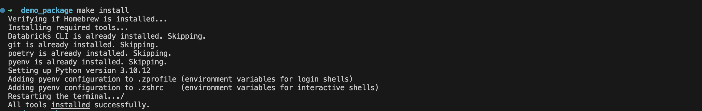
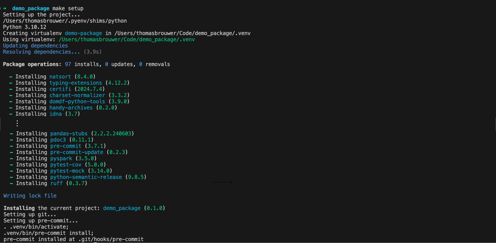
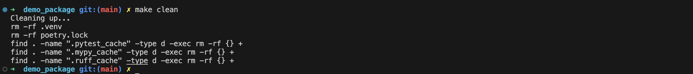
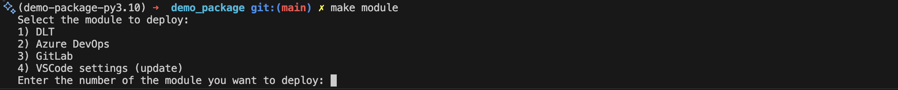
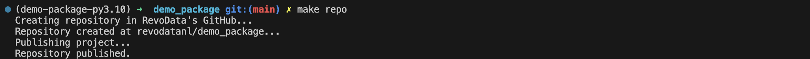
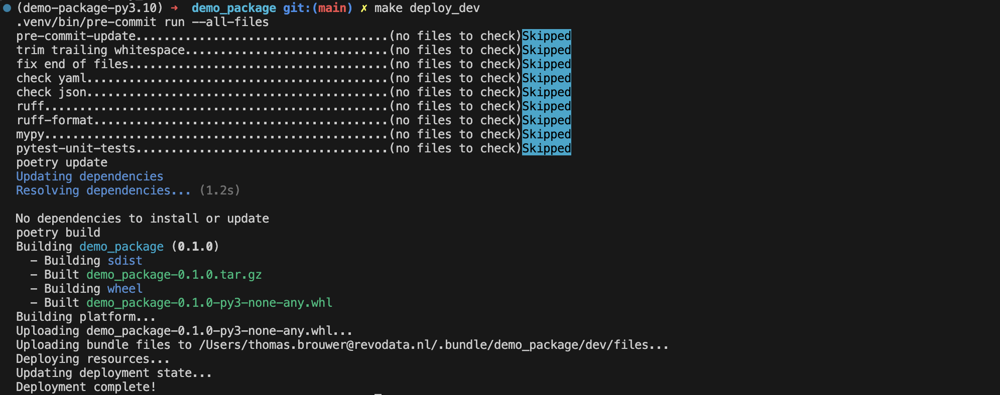
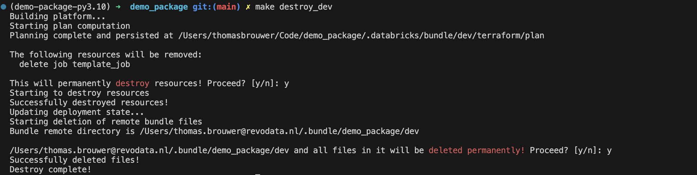

# scifi-boekenclub

[](https://www.python.org)
[](https://github.com/astral-sh/uv)
[](https://github.com/astral-sh/ruff)
[](http://mypy-lang.org/)
[](https://github.com/pre-commit/pre-commit)
[](https://github.com/semantic-release/semantic-release)

[](https://github.com/revodatanl/scifi/actions/workflows/ci.yml)
[](https://github.com/revodatanl/scifi/actions/workflows/semantic-release.yml)
[](docs/tests/coverage/index.html)
[](docs/tests/coverage/index.html)

The `scifi-boekenclub` Bundle was generated by using the [RevoData Asset Bundle Template](https://github.com/revodatanl/revo-asset-bundle-templates) version `0.5.3`.

## Prerequisites

The project heavily depends on the provided `Makefile` for various tasks. Without [make](https://www.gnu.org/software/make) installed, you will need to run the commands described in the `Makefile` manually.

Note that on **Windows** most commands need to be adjusted to function properly.

## Installation

With [make](https://www.gnu.org/software/make) installed, run the following command to install the prerequisites:

```bash
make install
```

This will install the following prerequisites:

- [Homebrew](https://brew.sh)
- [Git](https://git-scm.com)
- [uv](https://github.com/astral-sh/uv)



## Set up the development environment

To set up a fully configured development environment for this project run the following command:

```bash
make setup
```

This will use [uv](https://github.com/astral-sh/uv) to configure the correct [Python](https://www.python.org/) version specified in the `.python-version` file. Subsequently it will uinstall the dependencies, set up a virtual environment, activate it, and install the pre-commit hooks.




## Clean up the development environment

The following commands are available for development:

```bash
make clean
```

This command deactivates the virtual environment, removes the virtual environment and the `poetry.lock` file, and removes any caches.



## RevoData Modules

To add our custom modules to your project, run the following command:

```bash
make module
```



## Create GitHub repository

To create a repository in RevoData's GitHub, and add a remote to the local git repository containing the Bundle, use the following commands:

```bash
make repo
```

This assumes that the [GitHub CLI](https://cli.github.com) is installed, and access to the RevoData GitHub organization is granted and configured.




## Bundle Deployment

To deploy the Bundle to the appropriate Databricks workspace, use the following commands:

```bash
make deploy_*
```

The `*` in the command above can be replaced with the following options: `dev` or `prod`.



## Bundle Destruction

To remove the Bundle from the Databricks workspace, use the following command:

```bash
make destroy_*
```

The `*` in the command above can be replaced with the following options: `dev` or `prod`.



## Documentation

To build the documentation for the `scifi` project, run the following command:

```bash
make docs
```
